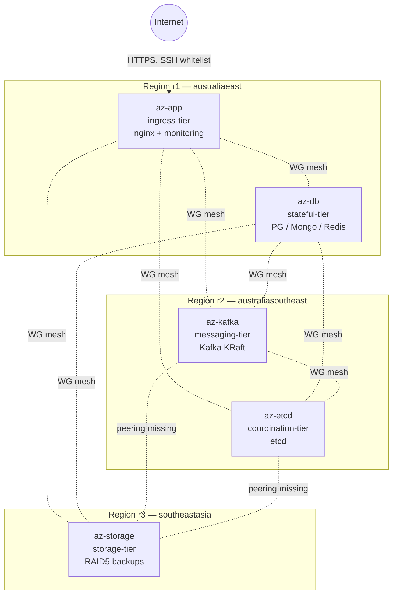
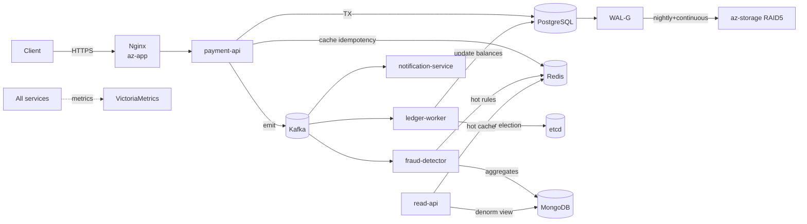

# Архитектура Aegis Capstone

> **TL;DR.** 5 VM в Azure (3 региона), пять изолированных tier'ов, связанных WireGuard full-mesh поверх VNet peering. Каждая база данных на отдельной VM или на отдельных физических дисках. Будущий Kubernetes — только на ingress-tier; stateful-tier намеренно остаётся на bare-metal/VM.

---

## 1. Tier'ы и узлы

| Tier | Узел | Регион | Public IP | Назначение |
|---|---|---|---|---|
| `ingress-tier` | `az-app` | r1 (australiaeast) | ✅ | Nginx (L7), будущий K8s control-plane, observability stack (VictoriaMetrics + Grafana) |
| `stateful-tier` | `az-db` | r1 | — | PostgreSQL, MongoDB, Redis (изоляция I/O — ADR-0002) |
| `messaging-tier` | `az-kafka` | r2 (australiasoutheast) | — | Kafka в KRaft, 2 диска JBOD (xfs) |
| `coordination-tier` | `az-etcd` | r2 | — | etcd, single-node (capstone-компромисс) |
| `storage-tier` | `az-storage` | r3 (southeastasia) | — | RAID 5 из 3 дисков, бэкапы, DR |

Регионы и адресные пространства VNet — см. [docs/topology.md](docs/topology.md).

## 2. Tier-диаграмма

> **⚠️ Известная проблема:** между r2 и r3 нет VNet peering, поэтому WireGuard endpoint между `kafka`/`etcd` и `storage` недостижим на L3. См. [ADR-0006](docs/adr/0006-r2-r3-peering.md).

## 3. Поток данных приложения (целевой)

Приложение — платёжный сервис Aegis Pay. Подробности — [docs/PROJECT_PLAN.md](docs/PROJECT_PLAN.md).

Каждая стрелка = реальный сетевой вызов через WG mesh, **не локальный IPC**.

## 4. Архитектурные решения

Все нетривиальные выборы зафиксированы в [docs/adr/](docs/adr/). Ключевые:

| ADR | Решение |
|---|---|
| [0001](docs/adr/0001-databases-on-vm-not-k8s.md) | Базы данных — на VM, не в K8s |
| [0002](docs/adr/0002-disk-isolation-per-database.md) | Каждая БД на отдельном managed disk + LVM |
| [0003](docs/adr/0003-multi-region-topology.md) | Распределение узлов по 3 регионам |
| [0004](docs/adr/0004-wireguard-mesh-zero-trust.md) | WireGuard full-mesh поверх VNet peering |
| [0005](docs/adr/0005-remove-generate-tf-py.md) | Удаление `generate_tf.py`, `*.tf` — единственный источник правды |
| [0006](docs/adr/0006-r2-r3-peering.md) | (Open) Добавить r2↔r3 peering или принять hub-and-spoke |

## 5. Что в инфре есть, но пока не используется

Инфра богаче, чем текущее приложение. Это **намеренно** — capstone должен показать готовый фундамент. План задействования — в [docs/PROJECT_PLAN.md](docs/PROJECT_PLAN.md).

| Компонент | Текущее использование | Целевое |
|---|---|---|
| PostgreSQL | пустая инсталляция | `payments`, `balances`, WAL-G → S3 |
| MongoDB | пустая инсталляция | read-models, fraud aggregates |
| Redis | пустая инсталляция | idempotency keys, hot cache, rate limiting |
| Kafka KRaft | пустые топики | event bus между сервисами |
| etcd | single-node идёт | leader election для воркеров |
| RAID5 storage | смонтирован | приёмник бэкапов WAL-G / mongodump |
| VictoriaMetrics + Grafana | поднимается | метрики всех сервисов + system metrics |
| containerd | поднимается на app | runtime для микросервисов (потом — K8s) |
| WireGuard mesh | поднимается | плоскость управления для Zero-Trust |

## 6. Out of scope (намеренно)

- High Availability на уровне БД (Patroni / MongoDB Replica Set / Kafka >1 brokers) — будет в roadmap.
- Vault / SOPS для секретов — пока plain Ansible vars.
- TLS между сервисами — WG mesh даёт зашифрованную транспортную плоскость, отдельный mTLS не делаем.
- Multi-cloud — был в ранних версиях, упразднён (см. git log).
- Real ML в fraud-detector — будут rule-based детекторы.

## 7. Roadmap (high-level)

См. [docs/PROJECT_PLAN.md](docs/PROJECT_PLAN.md) для пофазного плана. Кратко:

1. **Phase 0 — Hygiene.** Починить инфру (peering, удалить генератор, ADR'ы).
2. **Phase 1 — Foundation.** Полный прогон Ansible до зелёного, dashboard в Grafana.
3. **Phase 2 — Services.** 5–6 сервисов Aegis Pay, каждый со своей ролью.
4. **Phase 3 — Demo.** `make demo` — load-generator + автоматический показ потока в Grafana.
5. **Phase 4 — Hardening (optional).** HA, Vault, K8s миграция ingress-tier.
