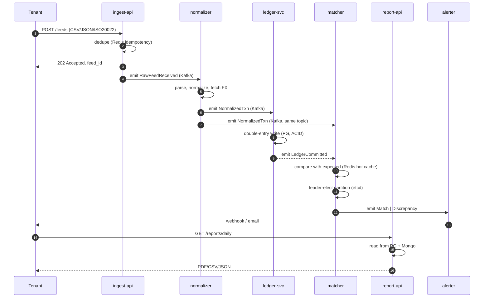

# Aegis Ledger — план продукта

> **TL;DR.** B2B SaaS для fintech-компаний: принимает транзакционные feeds (от банков, PSP, эквайеров), нормализует, мэтчит, ведёт двойной ledger в Postgres, отдаёт reports и alerts о расхождениях. Не публичный (клиенты — банки и финтехи), монетизация — per-transaction fee + enterprise SaaS. Развивается **в три фазы**: рабочий monolith → декомпозиция на сервисы → переложение на распределённую инфру (`az-app`/`az-db`/`az-kafka`/`az-etcd`/`az-storage`).

---

## 1. Бизнес-контекст: зачем это существует

### Проблема рынка
Любой fintech, обрабатывающий >10k транзакций/день, страдает от reconciliation:
- Платёжный провайдер прислал settlement-файл, его надо сверить с собственным журналом.
- В файле — другой формат, другой timezone, другой rounding, другие комиссии.
- Расхождения ловятся в ручном Excel'е, через несколько дней, ценой бухгалтерской катастрофы.

Конкуренты: **Modern Treasury**, **Stripe Treasury**, **Adyen Reconciliation**, инхаусные команды банков, разные легаси-вендоры (FIS, Finastra). Рынок реальный, оценивается в миллиарды (Modern Treasury закрыла Series C на $7.1B оценке).

### Почему B2B и не публично
- Клиенты — компании со штатом и compliance-отделом, не consumer.
- Подключение через VPN / private link / IP whitelist (отсюда [ADR-0004](adr/0004-wireguard-mesh-zero-trust.md) — Zero-Trust mesh ложится естественно).
- Sales cycle длинный, контрактами, не self-serve. Нет SEO-страниц, нет рекламы.

### Монетизация
- **Per-transaction fee** — $0.001–$0.01 за нормализованную транзакцию.
- **Enterprise SaaS** — годовые контракты от $50k за tier с SLA, dedicated tenant, audit retention.
- **Storage retention** — 7 лет аудита (compliance), отдельная плата за хранение.

### Кто покупает
- **Tier-2/Tier-3 банки** — у них нет своей инхаусной reconciliation-команды.
- **PSP / processor'ы** — нужно сверять с десятком acquirer'ов одновременно.
- **Crypto exchanges / neobanks** — высокий объём, разнородные feeds.
- **Маркетплейсы со встроенными платежами** — payouts в 50 стран = 50 форматов.

---

## 2. Что строим (домен)

### Канонические сущности

| Термин | Что это |
|---|---|
| **Tenant** | клиент платформы (банк/финтех), каждый изолирован |
| **Source** | внешний поставщик данных у tenant'а (например, "Stripe", "JPMorgan ACH", "Visa BASE II") |
| **Feed** | конкретный файл/поток от Source (settlement file, ISO 20022 message, webhook) |
| **RawEvent** | сырая запись из feed'а как пришла, неизменяемая |
| **NormalizedTxn** | каноническая транзакция после парсинга (общая модель для всех source'ов) |
| **LedgerEntry** | строка двойной записи в журнале (debit/credit) |
| **Account** | счёт в ledger'е (ассеты/обязательства/доходы/расходы) |
| **Match** | связка двух или более NormalizedTxn'ов, описывающая reconciliation event |
| **Discrepancy** | unmatched / mismatched транзакция, требующая human review |
| **Report** | агрегированный output для клиента (daily statement, audit trail, exception list) |

### Жизненный цикл транзакции



---

## 3. Сервисы и маппинг на инфраструктуру

Ниже — **полный** список сервисов с явным указанием, какие компоненты инфры они используют. Цель — каждый кубик инфры утилизирован.

### 3.1 `ingest-api`
**Что делает:** REST/Kafka endpoint для приёма feed'ов от tenant'ов. Аутентификация по mTLS / WG-overlay-IP. Идемпотентность по `(tenant_id, source_id, feed_hash)`.

| Использует | Зачем |
|---|---|
| **Nginx (`az-app`)** | TLS termination, rate limiting per tenant, ingress |
| **Redis** | idempotency keys (`SETNX feed_hash`), rate limit counters |
| **Kafka topic `raw-feeds`** | публикация принятых feed'ов для downstream |
| **Postgres** | tenant registry, source config, API keys |
| **VictoriaMetrics** | `ingest_requests_total`, `ingest_bytes`, latency histograms |

### 3.2 `normalizer-worker`
**Что делает:** парсит разные форматы (ISO 20022 MT940/CAMT.053, NACHA, CSV, JSON) → каноническая `NormalizedTxn`. Подтягивает FX-rates. Сохраняет raw payload для compliance.

| Использует | Зачем |
|---|---|
| **Kafka consumer `raw-feeds`** | вход |
| **MongoDB** | хранение `RawEvent` (полу-структурированный, разный per source) — 7 лет retention |
| **Kafka producer `normalized-txns`** | выход |
| **Redis** | cache FX-rates (TTL 1h) |
| **VictoriaMetrics** | `normalize_failures_total{source=}`, parse latency |

### 3.3 `ledger-service`
**Что делает:** двойная запись в PG, immutable journal. Source of truth для balance state. Транзакции с `SERIALIZABLE` isolation.

| Использует | Зачем |
|---|---|
| **PostgreSQL** | `accounts`, `journal_entries` таблицы, ACID, partitioning by month |
| **Kafka consumer `normalized-txns`** | вход |
| **Kafka producer `ledger-committed`** | выход (для downstream matcher и report) |
| **etcd** | distributed mutex на batch journal close (end-of-day) |
| **VictoriaMetrics** | `ledger_entries_committed_total`, journal close latency |

### 3.4 `matcher-worker`
**Что делает:** пытается смэтчить входящую `NormalizedTxn` с ожидаемой (по `external_ref`, amount, currency). Holds leader на партиции через etcd — иначе двойной матчинг = бухгалтерская катастрофа.

| Использует | Зачем |
|---|---|
| **Kafka consumer `normalized-txns`, `ledger-committed`** | вход |
| **Redis** | hot lookup ожидаемых платежей (sorted set по `expected_until`) |
| **etcd** | leader election per Kafka partition (`/aegis/matcher/leader/<partition>`) |
| **PostgreSQL** | persistence матчей (`matches`, `discrepancies`) |
| **Kafka producer `match-results`** | выход |
| **VictoriaMetrics** | `match_rate`, `discrepancy_rate{reason=}` |

### 3.5 `reconcile-batch-worker`
**Что делает:** ночные batch jobs — full sweep по дню, поиск unmatched, генерация daily reports. Single-writer per tenant (etcd lock).

| Использует | Зачем |
|---|---|
| **PostgreSQL** | агрегации, sweep |
| **MongoDB** | агрегации по raw events |
| **etcd** | global cron lock (`/aegis/jobs/daily-recon/<date>`) |
| **Kafka producer `report-ready`** | сигнал, что отчёт готов |
| **az-storage (RAID5)** | архив отчётов, output PDFs |

### 3.6 `report-api`
**Что делает:** REST API для tenant'ов — daily statements, balance state, audit trails, discrepancy list, export в PDF/CSV.

| Использует | Зачем |
|---|---|
| **Nginx (`az-app`)** | ingress, auth |
| **PostgreSQL** | balance, journal queries |
| **MongoDB** | raw event lookups (для audit drill-down) |
| **Redis** | cache горячих отчётов (TTL 5min) |
| **az-storage** | прединсталлированные PDF из batch-worker |

### 3.7 `alerter`
**Что делает:** consume `match-results` где `type=Discrepancy`, доставляет webhook tenant'у с retry/backoff. Email fallback.

| Использует | Зачем |
|---|---|
| **Kafka consumer `match-results`** | вход |
| **Redis** | rate limit per webhook URL, dead-letter queue |
| **PostgreSQL** | webhook subscriptions, delivery state |
| **VictoriaMetrics** | webhook delivery success rate, retries |

### 3.8 `archiver`
**Что делает:** периодически дампит «холодные» данные (старше 90 дней) с PG/Mongo на `az-storage` (RAID5) с компрессией. Compliance — 7-летний retention. Использует WAL-G для PG continuous backup.

| Использует | Зачем |
|---|---|
| **PostgreSQL** | source через WAL-G + pg_dump |
| **MongoDB** | source через mongodump |
| **az-storage RAID5** | приёмник архивов (`/mnt/backups/`) |
| **etcd** | leader election (один archiver глобально) |
| **VictoriaMetrics** | backup job duration, size, last-success timestamp |

### 3.9 `obs-stack` (инфраструктурный)
Не сервис домена, но обязательная часть проекта.

- **VictoriaMetrics** на `az-app` — приёмник всех метрик.
- **Grafana** на `az-app` — дашборды (см. §6).
- **node_exporter** на каждом узле — system metrics.
- (Phase 4) **Tempo** или Jaeger для tracing.

---

## 4. Сводная матрица: компонент инфры → кто использует

| Инфра-компонент | Используется сервисами | Если убрать — что сломается |
|---|---|---|
| **PostgreSQL** (`az-db`) | ingest-api, ledger-service, matcher, reconcile-batch, report-api, alerter, archiver | Полностью — это source of truth |
| **MongoDB** (`az-db`) | normalizer-worker, reconcile-batch, report-api, archiver | Audit retention, raw event drill-down |
| **Redis** (`az-db`) | ingest-api, normalizer-worker, matcher, report-api, alerter | Idempotency, rate limit, hot cache |
| **Kafka** (`az-kafka`) | все, кроме obs-stack | Backbone event-driven архитектуры |
| **etcd** (`az-etcd`) | ledger-service, matcher, reconcile-batch, archiver | Distributed locks → двойной матчинг → деньги пропадают |
| **az-storage RAID5** | reconcile-batch, archiver | Compliance / DR |
| **WireGuard mesh** | все межсервисные вызовы | Zero-Trust разваливается |
| **Nginx (`az-app`)** | ingest-api, report-api | Внешний ingress |
| **VictoriaMetrics** | все | Observability |

**Инвариант:** если хоть один сервис в плане не использует данную инфру — либо сервис лишний, либо инфра неоправдана. Текущий план — каждый компонент задействован минимум двумя сервисами.

---

## 5. Развитие проекта: фазы

> Принцип: сначала **рабочий прототип** (всё локально, monolith-ish), потом **декомпозиция**, потом **переложение на распределённую инфру**. Так делают в реальных стартапах: PoC → MVP → production.

### Phase 0 — Hygiene (инфра)
Цель: чистый старт, без блокеров от прошлой работы.

- [ ] Удалить `terraform/generate_tf.py` (см. [ADR-0005](adr/0005-remove-generate-tf-py.md)).
- [ ] Удалить мусорные директории `terraform/${path.module}/`, `terraform/${var.ansible_host_vars_dir}/`.
- [ ] Принять решение по [ADR-0006](adr/0006-r2-r3-peering.md), реализовать.
- [ ] Достроить `ansible/site.yml` чтобы прогонял все 8 ролей.
- [ ] Зелёный прогон `terraform apply` + `ansible-playbook` end-to-end.

**Done when:** `make deploy` или эквивалент работает с нуля за 15 минут, все 5 узлов настроены, WG mesh поднят, Grafana доступна.

---

### Phase 1 — Прототип (monolith on docker-compose)
Цель: рабочее приложение **локально**, с внутренним domain logic'ом, на docker-compose. Никакой Aegis-инфры пока не трогаем.

**Структура:**
```
app/
├── docker-compose.yml      # PG, Mongo, Redis, Kafka (single broker), все вместе
├── services/
│   ├── api/                # объединённый ingest+report (один FastAPI/Go-binary)
│   ├── worker/             # объединённый normalizer+matcher+ledger
│   └── shared/             # модели, протобуфы, миграции
├── migrations/
└── tests/
    └── e2e/                # один pytest, который шлёт feed → ждёт report
```

**Что есть:**
- Один монолит-API с всеми endpoint'ами.
- Один воркер, делающий весь pipeline в памяти.
- PG/Mongo/Redis/Kafka в docker-compose, single instance каждый.
- E2E-тест: «послали feed на 10 транзакций, через 5 секунд видим reconciled report».

**Чего нет:**
- Нет etcd (single-instance worker — нет distributed lock).
- Нет реальных feed-форматов кроме CSV (ISO 20022 — Phase 3).
- Нет HA, нет real WAL-G, нет archiver'а.

**Done when:** `docker compose up && make e2e-test` зелёный.

---

### Phase 2 — Декомпозиция на сервисы
Цель: разбить monolith на 8 отдельных бинарей, по-прежнему локально на docker-compose.

**Что меняется:**
- `services/api/` распадается на `ingest-api/` + `report-api/`.
- `services/worker/` распадается на `normalizer/` + `ledger/` + `matcher/` + `reconcile-batch/` + `alerter/` + `archiver/`.
- Появляется реальный Kafka topic-граф (см. §3).
- Появляется etcd, появляются leader elections.
- Каждый сервис — свой OCI-образ, свой `Dockerfile`.

**Что добавляется:**
- Реальные contracts между сервисами (protobuf / Avro в Kafka).
- Database-per-service не делаем (PG общий) — но schema-per-service делаем.
- Прометей-метрики `/metrics` на каждом сервисе.

**Done when:** docker-compose с 8 контейнерами и инфрой работает, e2e-тесты зелёные, видны метрики через `prom2json`.

---

### Phase 3 — Переложение на Aegis-инфру
Цель: то же самое приложение работает на 5 распределённых VM, через WG mesh.

**Маппинг где что живёт:**

| Сервис | Узел | Почему |
|---|---|---|
| Nginx, ingest-api, report-api | `az-app` | ingress-tier, public-facing |
| ledger-service | `az-app` (или будущий K8s) | без stateful storage сам, ходит в PG на `az-db` |
| normalizer-worker | `az-app` | то же |
| matcher-worker | `az-app` | то же |
| reconcile-batch-worker | `az-app` | cron-job, ходит в PG/Mongo через mesh |
| alerter | `az-app` | то же |
| archiver | `az-app` | пишет на `az-storage` через mesh |
| PostgreSQL | `az-db` | stateful-tier |
| MongoDB | `az-db` | stateful-tier |
| Redis | `az-db` | stateful-tier |
| Kafka | `az-kafka` | messaging-tier |
| etcd | `az-etcd` | coordination-tier |
| VictoriaMetrics, Grafana | `az-app` | obs-stack |
| node_exporter | все узлы | system metrics |

**Что меняется:**
- Все сервисы → containerd на `az-app` (через systemd-юниты или Compose-on-host пока).
- Kafka client'ы коннектятся на `10.100.0.12:9092` (overlay IP `az-kafka`).
- PG client'ы → `10.100.0.11:5432`.
- etcd client'ы → `10.100.0.13:2379`.
- archiver монтирует `az-storage:/mnt/backups` через NFS / SCP / rsync через WG.

**Что добавляется:**
- WAL-G для PG → S3 / RAID storage.
- Реальный backup job, восстанавливаемый PiTR.
- Grafana дашборд "Aegis Overview" (см. §6).
- Load-generator: `make demo` — `k6` сценарий, заливающий 1000 feed'ов/мин.

**Done when:** `make deploy && make demo` показывает живой поток данных в Grafana, `make e2e-test` зелёный против distributed развертывания.

---

### Phase 4 — Hardening (опционально, для резюме)
Если останется время / захочется блистать.

- HA: PG → Patroni, Mongo → Replica Set, Kafka → 3 broker'а.
- Vault для секретов.
- mTLS поверх WG (defence-in-depth).
- Tracing (OpenTelemetry → Tempo).
- Migration ingress-tier → Kubernetes (containerd уже стоит, осталось `kubeadm init`).
- Multi-tenancy hardening: row-level security в PG, namespace-isolation в Kafka.

---

## 6. Demo и наглядность

### `make demo` (single command)
Цель: внешний наблюдатель за 30 секунд видит систему живой.

```bash
make demo
# 1. terraform apply (если не было)
# 2. ansible-playbook site.yml
# 3. деплой OCI-образов сервисов на az-app
# 4. запуск load-generator (k6): 100 tenants, 50 feeds/sec, 60 секунд
# 5. открывает SSH-туннель к Grafana
# 6. печатает: open http://localhost:3000/d/aegis-overview
```

### Grafana дашборд `aegis-overview.json` (provisioned)
Панели:
- **Throughput** — feeds/sec, normalized txns/sec, ledger entries/sec.
- **Match rate** — % смэтченных vs discrepancies, по tenant/source.
- **Lag** — Kafka consumer-group lag по сервисам.
- **Latency** — p50/p95/p99 для ingest, normalize, match.
- **Resource pressure** — CPU/I/O по узлам, отдельный график I/O wait по дискам az-db (показывает, что [ADR-0002](adr/0002-disk-isolation-per-database.md) работает).
- **Mesh health** — WG handshakes, TCP retransmits на overlay.
- **Storage** — свободное место `az-storage` RAID5, last-backup timestamp.

### E2E trace в README
Реальный output `make demo-trace` показывает один платёж через всю систему:
```
[14:32:01.012] ingest-api      POST /v1/feeds        202 Accepted     8ms   (tenant=acme)
[14:32:01.013]   ├─ Redis SETNX feed_hash             1ms   (idempotency)
[14:32:01.014]   └─ Kafka emit raw-feeds              2ms
[14:32:01.020] normalizer      consumed RawFeedReceived           lag=6ms
[14:32:01.025]   ├─ Mongo write RawEvent              4ms
[14:32:01.027]   ├─ Redis lookup FX rate              <1ms (cached)
[14:32:01.029]   └─ Kafka emit normalized-txns        2ms
[14:32:01.035] ledger-svc      consumed NormalizedTxn             lag=6ms
[14:32:01.040]   └─ PG TX write 2 journal_entries     5ms  (SERIALIZABLE)
[14:32:01.041]      └─ Kafka emit ledger-committed    1ms
[14:32:01.046] matcher         leader-check (etcd)    1ms  (acquired)
[14:32:01.048]   ├─ Redis ZRANGE expected             <1ms
[14:32:01.050]   ├─ Match found                       2ms
[14:32:01.051]   └─ Kafka emit match-results          1ms
[14:32:01.060] alerter         consumed match-result             lag=9ms
                               (no discrepancy → no webhook)
TOTAL e2e: 48ms (within 100ms SLO)
```

Один блок — и читатель понимает, **зачем тут Kafka, etcd, Mongo, Redis**, и что архитектура работает.

---

## 7. Что НЕ делаем (намеренно)

- **UI / dashboard для tenant'ов** — REST API + curl + Grafana хватает. Tenant сам пилит свой UI.
- **Платёжная инициация** (PISP) — это другой регулируемый бизнес. Мы только reconciliation/ledger.
- **Реальная криптография KYC/AML** — это compliance-проект на годы.
- **15 микросервисов** — 8 покрывают всю инфру, больше — оверинженеринг для capstone.
- **Self-built Kafka client / PG driver** — берём `aiokafka`/`asyncpg`/etc.
- **ML в matcher'е** — rule-based достаточно («amount + ref + ±5min window»).

---

## 8. Технологические выборы (черновик, до ADR)

| Слой | Кандидаты | Предпочтение |
|---|---|---|
| Язык сервисов | Go / Rust / Python | **Go** — компактные бинари, лучший Kafka/etcd ecosystem, легко в OCI |
| Schema/contracts | protobuf / Avro / JSON Schema | **protobuf** — компактнее в Kafka, типобезопасность |
| Migrations PG | golang-migrate / Atlas | **golang-migrate** — простой, известный |
| HTTP framework | net/http + chi / Gin | **chi** — минимализм, ближе к stdlib |
| Тесты | testcontainers-go | да |
| Local infra | docker-compose | для Phase 1–2 |

После выбора — оформить [ADR-0007](adr/) «выбор языка и стека сервисов».

---

## 9. Риски

| Риск | Митигация |
|---|---|
| Phase 1 разрастается до Phase 2 «по дороге» | Жёсткий scope — monolith с одним API и одним worker, не больше |
| Kafka в одном узле — single point of failure | Принято в Phase 0–3, явно вынесено в Phase 4 |
| etcd single-node — потеря locks при failure | То же, явный compromise |
| WG-mesh флапает между регионами | PersistentKeepalive=25 + monitoring через VM |
| Утечка tenant data между tenant'ами | row-level security в PG (Phase 2+), separate Kafka partitions per tenant |

---

## 10. Открытые вопросы

- **`tenant_id` стратегия:** UUID per tenant + row-level security? Schema-per-tenant? **TBD** — нужен ADR.
- **PII обработка:** где хранятся номера счетов / PII customers tenant'ов? **TBD** — Vault или encrypted columns в PG.
- **Backup retention:** действительно ли 7 лет в RAID5 на одном узле — приемлемо? Реалистично нужно offsite (S3 другого региона). **TBD** — Phase 4.
- **Schema evolution в Kafka:** Confluent Schema Registry или просто versioned protobuf? **TBD** — ADR в Phase 2.
