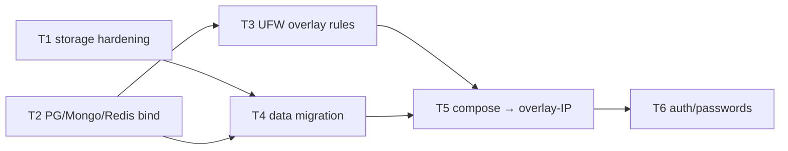

# EP-001: Phase 3 — stateful tier на `az-db` через WG overlay

## Контекст

Сейчас приложение использует **локальный** PG/Redis/Mongo на `az-app` в том же docker-compose. Это компромисс по [ADR-0007](../adr/0007-local-stateful-in-compose.md) — Phase 1/2.

При диагностике 2026-05-01 на узле `az-db` найдены **два независимых дефекта**, которые блокируют переезд на распределённую инфру:

| # | Дефект | Где | Проявление |
|---|---|---|---|
| 1 | Postgres/Mongo/Redis слушают `127.0.0.1` | `06-stateful-tier` не правит configs | приложение с `az-app` не достучится по overlay-IP |
| 2 | 3 managed disk подключены, но **не созданы LVM/mounted** | `01-storage` молча скипнулась (race на SCSI rescan) | данные БД лежат на 29GB OS-диске, не на выделенных 16GB Premium_LRS |

Эпик закрывает оба, плюс выводит изменения в compose и фиксирует пути миграции.

## Definition of Done

- [ ] `az-db`: `/var/lib/{postgresql,mongodb,redis}` смонтированы как `/dev/vg_*/lv_*` (16GB каждый), `df -h` подтверждает.
- [ ] `az-db`: `pg_isready -h 10.100.0.11` с любого `azure_node` отвечает `accepting connections`. То же для `redis-cli -h 10.100.0.11 ping`, `mongosh mongodb://10.100.0.11/admin`.
- [ ] UFW на `az-db` пропускает 5432/6379/27017 **только** с `10.100.0.0/24`.
- [ ] `docker-compose.yml` на `az-app`: `POSTGRES_HOST=10.100.0.11`, `REDIS_HOST=10.100.0.11`, локальные сервисы `postgres`/`redis`/`mongo` удалены из compose.
- [ ] `/v1/entries` на ledger-api делает `INSERT` в **az-db** (проверка: `docker exec` из az-db показывает запись), `/v1/match` использует **az-db** Redis.
- [ ] Повторный прогон `ansible-playbook site.yml` идемпотентен (`changed=0` для `01-storage` и `06-stateful-tier`).
- [ ] [ADR-0007](../adr/0007-local-stateful-in-compose.md) переведён в статус `Superseded by ADR-00XX` со ссылкой на новый ADR.

---

## Задачи

### T1 · Сделать роль `01-storage` устойчивой к SCSI race

**Слой:** Ansible · `roles/01-storage/`

**Контекст:** На первом прогоне kernel ещё не зарегистрировал диски, шаг "Резолв LUN" возвращает пустую строку, set_fact кладёт пустые `dev`, последующие задачи скипаются по `selectattr('dev', 'defined')` без ошибки.

**План:**
1. Добавить wait-for-device **после** SCSI rescan, **до** резолва LUN:
   ```yaml
   - name: Дождаться появления каждого LUN
     wait_for:
       path: "/dev/disk/by-path/acpi-MSFT1000:00-scsi-0:0:0:{{ item.lun }}"
       timeout: 60
     loop: "{{ aegis_data_devices | default([]) }}"
   ```
2. После резолва LUN — `fail` если `stdout` пустой (fail-fast вместо silent skip):
   ```yaml
   - assert:
       that:
         - item.dev is defined and item.dev | length > 0
       fail_msg: "LUN {{ item.lun }} не зарезолвился"
     loop: "{{ aegis_data_devices_final }}"
   ```
3. Заменить `ignore_errors: yes` в `lvol` на узкий `failed_when:` (например, по сообщению "matches existing size").

**Acceptance:**
- На свежем deploy `lsblk` на `az-db` показывает `vg_pgsql/lv_pgsql`, `vg_mongo/lv_mongo`, `vg_redis/lv_redis` со 100% usage диска.
- Намеренно сломанный host_vars (несуществующий LUN) → роль падает с понятным сообщением, не молча.
- Повторный прогон роли — `changed=0`.

**Riски:**
- `wait_for` на несуществующем path даёт `Timeout` через 60 сек — лучше чем silent skip, но удлиняет первый прогон. Trade-off приемлемый.

**Dependencies:** нет.

---

### T2 · Перенастроить bind PG/Mongo/Redis на overlay-IP

**Слой:** Ansible · `roles/06-stateful-tier/`

**Контекст:** Дефолтная инсталляция через `apt` слушает `127.0.0.1`. Никто извне (даже узел в той же VNet) не подключится.

**План:**

PostgreSQL:
```yaml
- name: PG listen_addresses на overlay
  lineinfile:
    path: /etc/postgresql/14/main/postgresql.conf
    regexp: '^#?listen_addresses\s*='
    line: "listen_addresses = '127.0.0.1,{{ wg_overlay_ip }}'"
  notify: restart postgresql
  when: "'db_nodes' in group_names"

- name: pg_hba для overlay
  lineinfile:
    path: /etc/postgresql/14/main/pg_hba.conf
    line: "host all all 10.100.0.0/24 scram-sha-256"
  notify: restart postgresql
  when: "'db_nodes' in group_names"
```

Redis:
```yaml
- name: Redis bind на overlay
  lineinfile:
    path: /etc/redis/redis.conf
    regexp: '^bind\s+'
    line: "bind 127.0.0.1 {{ wg_overlay_ip }}"
  notify: restart redis
- name: Redis protected-mode off (или пароль)
  lineinfile:
    path: /etc/redis/redis.conf
    regexp: '^protected-mode'
    line: "protected-mode no"   # или yes + requirepass
  notify: restart redis
```

Mongo:
```yaml
- name: Mongo bindIp на overlay
  lineinfile:
    path: /etc/mongod.conf
    regexp: '^\s+bindIp:'
    line: "  bindIp: 127.0.0.1,{{ wg_overlay_ip }}"
  notify: restart mongod
```

Парольная аутентификация — отдельная задача (T6, см. ниже). Сейчас MD5/scram + IP-фильтр на уровне UFW (T3).

**Acceptance:**
- `ss -tlnp | grep ':5432'` показывает `127.0.0.1:5432` **и** `10.100.0.11:5432`.
- Аналогично для 6379, 27017.
- С `az-app` (т.е. с `10.100.0.10`): `psql -h 10.100.0.11 -U aegis aegis` подключается; `redis-cli -h 10.100.0.11 ping` → PONG; `mongosh mongodb://10.100.0.11/admin --eval "db.runCommand({ping:1})"` → ok.

**Risки:**
- Перерестарт PG может временно прервать соединения — на этом этапе соединений к az-db нет (compose работает локально), окно нулевого риска.
- Если в `host_vars[az-db].wg_overlay_ip` не определена — роль упадёт. Зависит от T0 (см. порядок).

**Dependencies:** требует, чтобы роль `05-overlay-network` определила `wg_overlay_ip` в hostvars **до** запуска `06-stateful-tier` (порядок плеев в `site.yml` уже это гарантирует).

---

### T3 · UFW на `az-db`: открыть 5432/6379/27017 **только** для overlay

**Слой:** Ansible · `roles/03-security/`

**Контекст:** Сейчас UFW на az-db с `policy DROP` блокирует input. После T2 PG будет слушать overlay-IP, но без правила UFW трафик WG-туннеля не дойдёт.

**План:**
```yaml
- name: UFW для PG/Mongo/Redis от overlay-сети
  ufw:
    rule: allow
    src: 10.100.0.0/24
    port: "{{ item }}"
    proto: tcp
  loop: ['5432', '6379', '27017']
  when: "'db_nodes' in group_names"
```

Без `from any` — только overlay. Это именно Zero-Trust по [ADR-0004](../adr/0004-wireguard-mesh-zero-trust.md): VNet-сосед без WG-ключа не достучится.

**Acceptance:**
- `ufw status numbered` на az-db показывает три правила Allow от `10.100.0.0/24` к 5432/6379/27017.
- TCP probe от az-app (`10.100.0.10`) к `10.100.0.11:5432` — OPEN.
- TCP probe от любого другого (например, прямого VNet-IP `10.10.1.4` без WG) — REFUSED.

**Risки:** низкий. UFW идемпотентен.

**Dependencies:** T2 (BD должны слушать overlay-IP, иначе бесполезно открывать порт).

---

### T4 · Миграция данных PG/Mongo/Redis на новые mount-points

**Слой:** Ad-hoc на az-db (одноразовая операция)

**Контекст:** Postgres уже создал кластер на 29GB OS-диске. Если просто прогнать T1 — `mount` поверх `/var/lib/postgresql` спрячет существующую data-директорию, кластер исчезнет. Аналогично для Mongo/Redis.

**План (порядок критичен):**

```bash
# 1. Остановить сервисы
sudo systemctl stop postgresql mongod redis-server

# 2. Сохранить data-директории «в сторону»
sudo mv /var/lib/postgresql /var/lib/postgresql.pre-mount
sudo mv /var/lib/mongodb    /var/lib/mongodb.pre-mount
sudo mv /var/lib/redis      /var/lib/redis.pre-mount

# 3. Прогнать роль 01-storage (создаст LVM + mount)
ansible-playbook -i inventory/hosts.ini site.yml --tags storage --limit az-db

# 4. Положить данные на новый mount, восстановить ownership
sudo cp -a /var/lib/postgresql.pre-mount/. /var/lib/postgresql/
sudo chown -R postgres:postgres /var/lib/postgresql
sudo cp -a /var/lib/mongodb.pre-mount/.    /var/lib/mongodb/
sudo chown -R mongodb:mongodb /var/lib/mongodb
sudo cp -a /var/lib/redis.pre-mount/.      /var/lib/redis/
sudo chown -R redis:redis /var/lib/redis

# 5. Поднять обратно
sudo systemctl start postgresql mongod redis-server

# 6. Проверка
sudo -u postgres psql -c '\l'
mongosh --eval 'db.adminCommand("ping")'
redis-cli ping

# 7. Удалить .pre-mount после подтверждения
sudo rm -rf /var/lib/{postgresql,mongodb,redis}.pre-mount
```

**Acceptance:**
- `df -h /var/lib/postgresql` → `/dev/mapper/vg_pgsql-lv_pgsql`, `Avail ≈ 14G`.
- `psql -c '\l'` — все базы Phase 2 на месте (если они были).
- `.pre-mount` директории удалены, OS-disk free space вернулся.

**Risки:**
- **Высокий.** Потеря данных при ошибке в `cp -a` или `chown`. Использовать `-a` (preserve all attrs), не `-r`.
- На свежей инфре (никаких клиентских данных) можно скипнуть step 2/4 — просто `rm -rf` директории и прогнать T1, БД пересоздадут пустой кластер.

**Dependencies:** T1 (LVM-задачи должны быть исправлены). На текущем этапе capstone — данных нет, можно делать destructive вариант.

---

### T5 · Переключить compose на az-app на overlay-IP

**Слой:** `docker-compose.yml`

**Контекст:** Сейчас сервисы коннектятся через docker-DNS к локальным контейнерам `postgres`/`redis`/`mongo` ([ADR-0007](../adr/0007-local-stateful-in-compose.md)). После T1-T4 эти сервисы должны быть удалены из compose, env-vars переключены на overlay-IP.

**План:**

Изменения в `docker-compose.yml`:
```diff
 services:
-  postgres:
-    image: postgres:16-alpine
-    ...
-  redis:
-    image: redis:7-alpine
-    ...
-  mongo:
-    image: mongo:7.0
-    ...
-  zookeeper:
-    ...
-  kafka:
-    ...
   ledger-api:
     environment:
-      - POSTGRES_HOST=postgres
+      - POSTGRES_HOST=10.100.0.11
     depends_on:
-      postgres: { condition: service_healthy }
+      []
   matcher:
     environment:
-      - REDIS_HOST=redis
+      - REDIS_HOST=10.100.0.11
   normalizer:
     environment:
-      - KAFKA_BOOTSTRAP_SERVERS=kafka:29092
+      - KAFKA_BOOTSTRAP_SERVERS=10.100.0.12:9092
-      - MONGO_URI=mongodb://mongo:27017
+      - MONGO_URI=mongodb://10.100.0.11:27017

 volumes:
-  pgdata: {}
-  redisdata: {}
-  mongodata: {}
```

> ⚠️ Volume'ы локальных контейнеров (`pgdata`, `redisdata`, `mongodata`) удалить только **после успеха T6** — это страховка отката.

Дополнительно: az-kafka тоже слушает на `127.0.0.1` (по аналогии с PG) — Kafka KRaft нужно настроить `listeners=PLAINTEXT://10.100.0.12:9092` через роль `06-stateful-tier`. Это **расширяет T2** на kafka_nodes.

**Acceptance:**
- На az-app: `docker compose ps` показывает только app-сервисы (3 шт.), без stateful.
- `docker compose up -d --force-recreate` — все 3 контейнера healthy.
- `/ready` каждого app-сервиса возвращает `"ok"` для всех overlay-deps.
- `POST /v1/entries` пишет в **az-db** PG (`docker exec на az-db: psql -c 'SELECT count(*) FROM journal_entries'`).

**Risки:**
- WG-туннель может моргнуть → connection drop в asyncpg/redis pool. Проверить, что pool делает reconnect.
- Latency overlay r1↔r1 (az-app↔az-db, оба в южной Asia) — ~1-2 ms, ок.

**Dependencies:** T1, T2, T3, T4.

---

### T6 · (опционально) Парольная аутентификация для PG/Mongo/Redis

**Слой:** Ansible + Vault

**Контекст:** Сейчас IP-фильтр на UFW + IP-list в pg_hba.conf. Если кто-то получит доступ к WG-ключу любого узла — получит все БД без пароля.

**План:**
1. Сгенерировать пароли в Ansible Vault (`ansible-vault encrypt_string`).
2. Передать в роль `06-stateful-tier`:
   - PG: `CREATE ROLE aegis WITH LOGIN PASSWORD '...';` + `pg_hba.conf` `scram-sha-256`.
   - Redis: `requirepass <pw>` в `redis.conf`.
   - Mongo: `db.createUser({user:"aegis", pwd:"...", roles:[...]})`, `security.authorization: enabled` в `mongod.conf`.
3. В compose env-vars `POSTGRES_PASSWORD`, `REDIS_PASSWORD`, `MONGO_URI=mongodb://aegis:pw@...`.

**Acceptance:**
- `psql -h 10.100.0.11 -U aegis aegis` без `-W` падает с password-prompt.
- В compose env'ах прописан пароль из vault.

**Risки:** добавляет complexity, но перед prod-ready это must-have.

**Dependencies:** T2, T3, T5. Не блокер для DoD эпика — может быть отложено.

---

## Граф зависимостей



Параллельно можно делать **T1 ↔ T2** (разные роли). Затем последовательно T3 → T4 → T5.

## Out of scope (вынесено в будущие эпики)

- **HA**: Patroni для PG, Mongo Replica Set, Kafka 3 broker'а. → EP-002.
- **Backup**: WAL-G на `az-storage` через RAID5. → EP-003.
- **Tracing**: OpenTelemetry → Tempo. → EP-004.
- **Migration ingress на K8s**: kubeadm на az-app. → EP-005.
- **Vault для секретов** (не Ansible Vault, а HashiCorp Vault). → EP-006.

## Оценка

- T1: 1 час (правка роли, тест на свежей VM).
- T2: 2 часа (3 сервиса × лекало lineinfile + handlers + testcontainer).
- T3: 30 мин.
- T4: 30 мин (на свежей инфре — 5 мин, на инфре с данными — час с осторожностью).
- T5: 1 час.
- T6: 3 часа (Vault setup + Mongo auth впервые).

**Без T6 эпик закрывается за ~5 часов реальной работы.**
