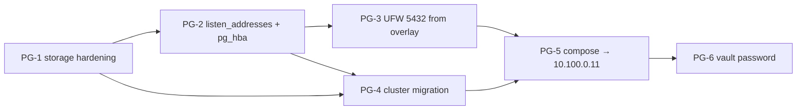

# EP-002: PostgreSQL — переезд на `az-db` через overlay

> Подмножество [EP-001](EP-001-phase-3-stateful-tier.md), сфокусированное только на PostgreSQL. Можно закрыть независимо: ledger-api получит реальный PG на `az-db`, остальные сервисы (matcher → Redis, normalizer → Mongo/Kafka) пока остаются на локальных контейнерах.

## Контекст (PG-специфичный)

На `az-db` (2026-05-01) обнаружено:

1. **`/var/lib/postgresql` НЕ на выделенном диске** — данные PG лежат на 29GB OS-диске. По [ADR-0002](../adr/0002-disk-isolation-per-database.md) ожидался `/dev/vg_pgsql/lv_pgsql` (16GB Premium_LRS).
2. **`listen_addresses = localhost`** — PG слушает только `127.0.0.1:5432`. С `az-app` через WG overlay не подключиться.
3. **UFW DROP** — даже после фикса bind, без правила trafic 5432 не дойдёт.

LUN-резолв сейчас работает (`/dev/disk/by-path/.../scsi-0:0:0:0 → sdc`), но первый прогон роли `01-storage` молча скипнул мount-задачи из-за SCSI rescan race и `selectattr('dev', 'defined')`.

## Definition of Done

- [ ] `df -h /var/lib/postgresql` на az-db → `/dev/mapper/vg_pgsql-lv_pgsql`, `Avail ≈ 14G`.
- [ ] `pg_isready -h 10.100.0.11 -U aegis` с `az-app` → `accepting connections`.
- [ ] `psql -h 10.100.0.11 -U aegis aegis -c '\l'` с `az-app` показывает базы.
- [ ] UFW на az-db пропускает 5432 **только** от `10.100.0.0/24` (TCP probe от чужого VNet-IP — REFUSED).
- [ ] `docker-compose.yml` на az-app: `POSTGRES_HOST=10.100.0.11`, локальный `postgres:16-alpine` сервис удалён, volume `pgdata` оставлен на 1 итерацию для отката.
- [ ] `ledger-api` `POST /v1/entries` пишет в `az-db`, `psql` на az-db показывает запись.
- [ ] Повторный прогон `ansible-playbook` с тегом `pg` → `changed=0`.

---

## Задачи

### PG-1 · Хардненить `01-storage` под pgsql-диск

**Слой:** Ansible · `roles/01-storage/`
**Затрагивает host_vars:** `az-db.yml` (`name=pgsql, lun=0, fs=ext4, mount=/var/lib/postgresql`)

**Контекст:** SCSI rescan не дожидается появления устройства, LUN-резолв возвращает пустую строку, последующие задачи скипаются по `selectattr('dev', 'defined')` без падения.

**План:**
1. После `Рескан SCSI шины` (строка 4-9 в `tasks/main.yml`) — добавить:
   ```yaml
   - name: Дождаться появления каждого LUN в /dev/disk/by-path
     wait_for:
       path: "/dev/disk/by-path/acpi-MSFT1000:00-scsi-0:0:0:{{ item.lun }}"
       timeout: 60
       state: present
     loop: "{{ aegis_data_devices | default([]) }}"
     loop_control:
       label: "LUN {{ item.lun }} → {{ item.name }}"
   ```
2. Между `Резолв LUN` и `Подготовка списков устройств` — добавить assert:
   ```yaml
   - name: Проверить что LUN-резолв успешен
     assert:
       that:
         - item.stdout is defined
         - item.stdout | length > 0
       fail_msg: "LUN {{ item.item.lun }} не зарезолвился — диск не подключен?"
     loop: "{{ resolved_data_devs.results | default([]) }}"
     when: not item.skipped | default(false)
   ```
3. Заменить `ignore_errors: yes` в задаче `Создание Logical Volume`:
   ```yaml
   register: lvol_result
   failed_when:
     - lvol_result.failed
     - "'matches existing size' not in lvol_result.msg | default('')"
   ```

**Acceptance:**
- На свежем deploy `lsblk` на `az-db` показывает `vg_pgsql/lv_pgsql` 16GB ext4.
- `mount | grep postgresql` → `/dev/mapper/vg_pgsql-lv_pgsql on /var/lib/postgresql type ext4`.
- Намеренно сломанный `lun: 99` в host_vars → роль падает с `LUN 99 не зарезолвился`, не молча.

**Риски:** низкий. `wait_for` идемпотентен.

**Dependencies:** нет.

---

### PG-2 · Настроить `listen_addresses` и `pg_hba.conf`

**Слой:** Ansible · `roles/06-stateful-tier/`

**Контекст:** Дефолтный `apt install postgresql` слушает `localhost`. Нужно добавить overlay-IP узла + правило в `pg_hba.conf` для overlay-сети.

**План:**

Добавить в `06-stateful-tier/tasks/main.yml` после установки postgresql пакета:

```yaml
- name: PG listen_addresses на overlay
  lineinfile:
    path: /etc/postgresql/14/main/postgresql.conf
    regexp: '^#?listen_addresses\s*='
    line: "listen_addresses = '127.0.0.1,{{ wg_overlay_ip }}'"
    backup: yes
  notify: restart postgresql
  when: "'db_nodes' in group_names"

- name: PG разрешить подключения с overlay-сети
  lineinfile:
    path: /etc/postgresql/14/main/pg_hba.conf
    line: "host all all 10.100.0.0/24 scram-sha-256"
    insertafter: '^# IPv4 local connections:'
  notify: restart postgresql
  when: "'db_nodes' in group_names"

- name: Создать роль aegis в PG
  community.postgresql.postgresql_user:
    name: aegis
    password: "{{ pg_aegis_password }}"
    state: present
  become: yes
  become_user: postgres
  when: "'db_nodes' in group_names"

- name: Создать БД aegis
  community.postgresql.postgresql_db:
    name: aegis
    owner: aegis
    state: present
  become: yes
  become_user: postgres
  when: "'db_nodes' in group_names"
```

Handler в `roles/06-stateful-tier/handlers/main.yml`:
```yaml
- name: restart postgresql
  systemd:
    name: postgresql
    state: restarted
```

Переменная `pg_aegis_password` — пока в `group_vars/all.yml` plain (на этапе capstone), позже Vault (PG-6).

> ⚠️ Требует коллекцию `community.postgresql` и пакет `python3-psycopg2` на az-db (последний — добавить в `apt` в эту же роль).

**Acceptance:**
- `ss -tlnp | grep ':5432'` на az-db → две строки: `127.0.0.1:5432` **и** `10.100.0.11:5432`.
- С az-app: `pg_isready -h 10.100.0.11 -U aegis` → `accepting connections`.
- `psql -h 10.100.0.11 -U aegis -d aegis -c '\du'` показывает роль `aegis`.

**Риски:**
- `wg_overlay_ip` определяется в `05-overlay-network` через `set_fact` — он есть только в текущем прогоне playbook'а. **Гарантировать порядок плеев в `site.yml`:** `05-overlay-network` → `06-stateful-tier`. Уже выполняется.
- Если postgresql не запущен на момент `restart` (например после `apt install` он `active`), handler сработает корректно.

**Dependencies:** PG-1 (mount должен быть готов до старта PG, иначе кластер сначала создастся на OS-диске и потребуется PG-4).

---

### PG-3 · UFW: открыть 5432 только от overlay

**Слой:** Ansible · `roles/03-security/`

**Контекст:** UFW на az-db в `policy DROP`. Без явного allow от `10.100.0.0/24` трафик к 5432 не дойдёт даже после PG-2.

**План:**

В `roles/03-security/tasks/main.yml` уже есть блок для DB-портов. Сейчас источник там — широкий (или `any`). Нужно ограничить overlay-сетью:

```yaml
- name: Allow PG (5432) только от overlay
  ufw:
    rule: allow
    src: 10.100.0.0/24
    port: '5432'
    proto: tcp
  when: "'db_nodes' in group_names"
```

**Acceptance:**
- `ufw status verbose` на az-db: `5432/tcp ALLOW IN 10.100.0.0/24`.
- TCP probe от az-app (через WG, src 10.100.0.10) к `10.100.0.11:5432` → OPEN.
- TCP probe от az-app по VNet-IP (`10.10.1.X` без WG) → REFUSED/DROP.

**Риски:** минимальные.

**Dependencies:** PG-2 (без bind на overlay-IP открывать порт бессмысленно).

---

### PG-4 · Миграция PG-кластера на новый mount

**Слой:** Ad-hoc на az-db (одноразовая операция)

**Контекст:** PG уже создал `main` cluster в `/var/lib/postgresql/14/main` на OS-диске. Если просто примонтировать LVM поверх — кластер исчезнет (mountpoint накроет содержимое).

**План (порядок критичен):**

```bash
# На az-db:

# 1. Остановить PG
sudo systemctl stop postgresql

# 2. Сохранить data-директорию
sudo mv /var/lib/postgresql /var/lib/postgresql.pre-mount

# 3. Прогнать только storage-роль с master-узла:
#    ansible-playbook -i inventory/hosts.ini site.yml --tags storage --limit az-db
# (или вручную:)
sudo mkdir -p /var/lib/postgresql
sudo mount /dev/mapper/vg_pgsql-lv_pgsql /var/lib/postgresql
# в /etc/fstab уже должна быть запись после PG-1; если нет — добавить вручную

# 4. Положить cluster обратно с правильным ownership
sudo cp -a /var/lib/postgresql.pre-mount/. /var/lib/postgresql/
sudo chown -R postgres:postgres /var/lib/postgresql
sudo chmod 700 /var/lib/postgresql/14/main

# 5. Запустить PG
sudo systemctl start postgresql
sudo -u postgres psql -c '\l'   # должны быть базы как до миграции

# 6. После проверки удалить .pre-mount
sudo rm -rf /var/lib/postgresql.pre-mount
```

**Альтернатива на свежей инфре** (если данных нет — capstone): **destructive вариант**:
```bash
sudo systemctl stop postgresql
sudo rm -rf /var/lib/postgresql
sudo apt-get install --reinstall -y postgresql-14   # пересоздаст кластер на новом mount
sudo systemctl start postgresql
```

**Acceptance:**
- `df -h /var/lib/postgresql` → `/dev/mapper/vg_pgsql-lv_pgsql`, не `/dev/root`.
- `sudo -u postgres psql -c '\l'` показывает все БД, которые были до миграции.
- `/var/lib/postgresql/14/main/PG_VERSION` доступен, owner `postgres:postgres`.
- `.pre-mount` удалён, OS-disk освободил ~100MB.

**Риски:**
- **Высокий.** Потеря данных при ошибке `cp -a` или `chown`. Использовать именно `cp -a` (не `cp -r`), preserve all attrs.
- На capstone-инфре без важных данных предпочтителен destructive вариант.

**Dependencies:** PG-1 (LVM создан и mount работает).

---

### PG-5 · Переключить ledger-api на az-db PG

**Слой:** `docker-compose.yml` + сборка ledger-api

**Контекст:** Сейчас `ledger-api` коннектится к локальному `postgres` контейнеру через docker-DNS ([ADR-0007](../adr/0007-local-stateful-in-compose.md)). После PG-2/3 нужно переключить env-vars на overlay-IP.

**План:**

Изменения в `docker-compose.yml` (только PG-релевантные):
```diff
 services:
-  postgres:
-    image: postgres:16-alpine
-    container_name: postgres
-    environment:
-      - POSTGRES_USER=aegis
-      - POSTGRES_PASSWORD=aegis_dev_only
-      - POSTGRES_DB=aegis
-    volumes:
-      - pgdata:/var/lib/postgresql/data
-    healthcheck: ...
-
   ledger-api:
     environment:
-      - POSTGRES_HOST=postgres
+      - POSTGRES_HOST=10.100.0.11
       - POSTGRES_PORT=5432
       - POSTGRES_USER=aegis
-      - POSTGRES_PASSWORD=aegis_dev_only
+      - POSTGRES_PASSWORD={{ pg_aegis_password }}     # из ansible vault
       - POSTGRES_DB=aegis
     depends_on:
-      postgres: { condition: service_healthy }
+      []   # az-db живёт независимо

 volumes:
-  pgdata: {}                    # ⚠️ пока оставить: страховка отката
+  # pgdata: {}                  # удалить после успеха PG-5+проверки
```

> ⚠️ **Не удалять volume `pgdata` сразу** — на 1-2 итерации оставить как fallback. После того как ledger-api стабильно пишет в az-db и e2e-test зелёный — `docker volume rm aegis-app_pgdata` и удалить из compose.

Дополнительно: версии PG разные (compose `postgres:16` vs az-db `14`). Проверить, что `asyncpg` в `app/ledger-api/requirements.txt` совместим с обоими (он совместим с PG 12+, проблем нет).

**Acceptance:**
- На az-app: `docker compose ps` не показывает контейнер `postgres`.
- `docker logs ledger-api 2>&1 | head` — нет `connection refused`.
- `curl http://localhost:8081/ready` → `{"ready":true,"deps":{"postgres":"ok"}}`.
- `curl -X POST .../v1/entries -d '{...}'` → `{"entry_id":"led_...","status":"accepted"}`.
- На az-db: `psql -U aegis -d aegis -c "SELECT count(*) FROM journal_entries;"` → ≥ 1.

**Риски:**
- Latency: az-app↔az-db через WG overlay, оба в r1 (southeastasia) — ожидается ~1ms, не проблема.
- Pool reconnect: asyncpg по дефолту recreate соединений, healthcheck покажет если что-то.

**Dependencies:** PG-1, PG-2, PG-3, PG-4.

---

### PG-6 · (опционально) Перенести пароль PG в Ansible Vault

**Слой:** Ansible · `group_vars/all.yml` + `ansible-vault`

**Контекст:** В PG-2 переменная `pg_aegis_password` хранится в открытом виде в `group_vars`. Для capstone приемлемо, для close-to-prod — нет.

**План:**
```bash
ansible-vault create group_vars/all/vault.yml
# Внутри:
# vault_pg_aegis_password: <strong-random>

# В group_vars/all/main.yml:
# pg_aegis_password: "{{ vault_pg_aegis_password }}"

# Запуск:
ansible-playbook site.yml --ask-vault-pass
```

В compose-контексте — пароль передавать через env-vars из `terraform/inventory.tf`, либо через отдельный `.env` (gitignored), либо переходить на `azurerm_key_vault` (но это отдельный эпик EP-006).

**Acceptance:**
- `git grep -i 'aegis_dev_only\|aegis_password = '` ничего не находит в plain-text.
- `ansible-playbook site.yml` без `--ask-vault-pass` падает с `Decryption failed`.
- ledger-api продолжает работать.

**Риски:** Vault-pass нужно где-то хранить (в CI это secret, локально — `~/.vault_pass`). Не блокирует DoD эпика.

**Dependencies:** PG-2, PG-5.

---

## Граф зависимостей



PG-1 и PG-2 можно начинать параллельно (разные роли), но PG-2 требует чтобы PG-1 уже был **применён на узле** до миграции (иначе PG-4 нужно будет повторять).

## Out of scope

- HA через Patroni — будет в EP-002-extension или новом эпике.
- WAL-G на az-storage — EP-003 (общий backup для PG/Mongo).
- pgBouncer перед PG — пока не нужен (нагрузка capstone-уровня).
- Mongo и Redis — параллельные эпики EP-002R (Redis) и EP-002M (Mongo), либо весь EP-001.

## Оценка

| Задача | Время |
|---|---|
| PG-1 | 1 ч |
| PG-2 | 1.5 ч |
| PG-3 | 20 мин |
| PG-4 | 30 мин (на capstone — destructive вариант 5 мин) |
| PG-5 | 30 мин |
| PG-6 | 1.5 ч |
| **Итого без PG-6** | **~4 часа** |
