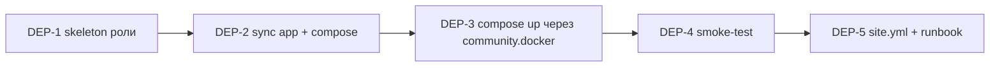

# EP-003: Автоматизация деплоя сервисов на `az-app`

## Контекст

Текущий gap архитектуры (см. [`docs/runbooks/deploy-services.md`](../runbooks/deploy-services.md)):

| Этап | Автоматизация |
|---|---|
| Provision (5 VM) | ✅ Terraform |
| OS + БД + WG mesh | ✅ `ansible-playbook site.yml` |
| **Микросервисы compose** | ❌ **`rsync app/ + scp compose + ssh up -d` руками** |

После каждого `terraform apply` оператор должен помнить: «теперь руками деплой compose». В runbook это Шаг 8, отдельный от плейбука. Если IP меняется — снова руками. Каждый push кода — снова руками. Это:
- Раздражает в разработке.
- Не воспроизводится без человека.
- Не вызывается из CI.
- Не фиксируется в `last_verified` плейбука.

Цель эпика — **встроить деплой compose в `site.yml`**, чтобы один прогон `ansible-playbook` разворачивал всё от пустой VM до работающих микросервисов.

**Не пересекается с EP-001/EP-002:** trogает только узел `az-app`, новую Ansible-роль и compose-файл. PG/Mongo/Redis/UFW не правит.

## Definition of Done

- [ ] Существует роль `ansible/roles/08-app-deploy/` с фронтматтером + README.
- [ ] `site.yml` содержит финальный плей `App services (compose)` для группы `app_nodes` после `07-observability`.
- [ ] После полного прогона `ansible-playbook site.yml` на свежей VM: на `az-app` запущены все контейнеры из `docker-compose.yml`, все `(healthy)`.
- [ ] Повторный прогон playbook'а **без изменений в `app/`** — `changed=0` для роли `08-app-deploy`.
- [ ] Изменение в `app/ledger-api/main.py` → повторный прогон → новый image, контейнер `recreated`, остальные не тронуты.
- [ ] Из `docs/runbooks/deploy-services.md` удалены Шаги 1-6 «руками» (заменены ссылкой «всё делает `site.yml`»). Остаётся только troubleshooting и ручные команды для отладки.
- [ ] Шаги «open port для теста через SSH-туннель» сохранены — это операционная задача, не деплой.

---

## Задачи

### DEP-1 · Создать роль `08-app-deploy` (скелет)

**Слой:** Ansible · `roles/08-app-deploy/`

**Контекст:** Новая роль, целевая группа — `app_nodes` (=`az-app`). Должна быть поверх `04-runtime` (Docker уже стоит) и `05-overlay-network` (mesh поднят).

**План:**

Создать структуру:
```
roles/08-app-deploy/
├── README.md           # frontmatter + краткое описание (по образцу 01-storage/README.md)
├── tasks/main.yml
├── handlers/main.yml
├── defaults/main.yml   # aegis_app_dir: /opt/aegis-app
└── meta/main.yml       # dependencies: [04-runtime]
```

`defaults/main.yml`:
```yaml
aegis_app_dir: /opt/aegis-app
aegis_compose_recreate: false   # true для force-recreate
```

`meta/main.yml`:
```yaml
dependencies: []   # 04-runtime запускается раньше через site.yml порядок
galaxy_info:
  role_name: app_deploy
```

`tasks/main.yml` — пока stub с одной задачей `debug` (заполнится в DEP-2, DEP-3).

**Acceptance:**
- `ansible-playbook -i inventory/hosts.ini site.yml --tags app_deploy --check` проходит без ошибок (даже если ничего не делает).
- В `site.yml` появился новый плей с этой ролью на `app_nodes` (после observability).

**Риски:** минимальные.

**Dependencies:** нет.

---

### DEP-2 · Скопировать `docker-compose.yml` и `app/` на узел

**Слой:** Ansible · `roles/08-app-deploy/tasks/`

**Контекст:** Сейчас `rsync app/` + `scp docker-compose.yml`. Перенести в Ansible-задачи.

**План:**

```yaml
- name: Создать директорию приложения
  file:
    path: "{{ aegis_app_dir }}"
    state: directory
    owner: "{{ ansible_user }}"
    group: "{{ ansible_user }}"
    mode: '0755'

- name: Синхронизировать app/ (источники сервисов)
  ansible.posix.synchronize:
    src: "{{ playbook_dir }}/../app/"
    dest: "{{ aegis_app_dir }}/app/"
    delete: yes
    rsync_opts:
      - "--exclude=.venv"
      - "--exclude=__pycache__"
      - "--exclude=.pytest_cache"
  register: app_sync
  notify: rebuild and recreate compose

- name: Деплой docker-compose.yml
  copy:
    src: "{{ playbook_dir }}/../docker-compose.yml"
    dest: "{{ aegis_app_dir }}/docker-compose.yml"
    owner: "{{ ansible_user }}"
    mode: '0644'
  register: compose_file
  notify: rebuild and recreate compose
```

`handlers/main.yml`:
```yaml
- name: rebuild and recreate compose
  community.docker.docker_compose_v2:
    project_src: "{{ aegis_app_dir }}"
    state: present
    build: always
    recreate: auto
```

> ⚠️ Требуется коллекция `community.docker` (добавить в `requirements.yml` или установить через `ansible-galaxy collection install`).

**Acceptance:**
- На свежей VM после прогона роли: `/opt/aegis-app/app/{ledger-api,normalizer,matcher}/` существует с правильным содержимым.
- `/opt/aegis-app/docker-compose.yml` идентичен локальному.
- Повторный прогон без изменений → `changed=0`, handler не триггерится.
- Правка `app/ledger-api/main.py` → следующий прогон триггерит handler.

**Риски:**
- `synchronize` требует rsync на target узле — ставится в роли `04-runtime` или базовом образе. Если нет — добавить в роль.
- Большие файлы (>10MB) в `app/` могут замедлить — у нас сорцы маленькие.

**Dependencies:** DEP-1.

---

### DEP-3 · Поднять стек через `community.docker.docker_compose_v2`

**Слой:** Ansible · `roles/08-app-deploy/handlers/` + tasks

**Контекст:** Хендлер из DEP-2 запускает compose. Нужно убедиться, что:
- Образы пересобираются при изменении исходников.
- Старые контейнеры заменяются без даунтайма (по одному).
- При первом прогоне (no handler trigger, потому что файлы новые) compose всё равно поднимается.

**План:**

В `tasks/main.yml` добавить **после** sync:
```yaml
- name: Гарантированно поднять compose (на случай если handler не триггернулся)
  community.docker.docker_compose_v2:
    project_src: "{{ aegis_app_dir }}"
    state: present
    build: policy   # build только если изменился контекст
  register: compose_up

- name: Force-recreate (если задано через --extra-vars aegis_compose_recreate=true)
  community.docker.docker_compose_v2:
    project_src: "{{ aegis_app_dir }}"
    state: present
    recreate: always
    build: always
  when: aegis_compose_recreate | bool
```

В `meta/main.yml` добавить `collections: [community.docker]` или зафиксировать в `requirements.yml`.

**Acceptance:**
- На свежей VM: `docker ps` показывает все контейнеры из compose, `(healthy)`.
- Повторный прогон без изменений: `compose_up.changed == false`.
- `ansible-playbook ... -e aegis_compose_recreate=true` пересоздаёт контейнеры.
- На VM с уже работающим compose: правка одного `main.py` → новый прогон → пересоздаётся **только** изменённый сервис, остальные `Up`.

**Риски:**
- `build: policy` требует Compose v2.20+. Проверить версию docker-compose-plugin в `04-runtime` и Packer-image.
- `community.docker` v3+ переименовала ряд аргументов — закрепить версию коллекции.

**Dependencies:** DEP-2.

---

### DEP-4 · Smoke-test после деплоя

**Слой:** Ansible · `roles/08-app-deploy/tasks/`

**Контекст:** После `up -d` сервисы стартуют асинхронно (start_period в healthcheck = 15s). Прогон playbook'а должен **проверить**, что все три endpoint'а отвечают, иначе fail.

**План:**

```yaml
- name: Дождаться готовности сервисов (через docker healthcheck)
  shell: |
    docker inspect --format '{{ "{{" }}.State.Health.Status{{ "}}" }}' {{ item }}
  register: health_check
  until: health_check.stdout == "healthy"
  retries: 12
  delay: 5
  loop: ['ledger-api', 'normalizer', 'matcher']
  changed_when: false

- name: Smoke-test /health endpoints
  uri:
    url: "http://127.0.0.1:{{ item.port }}/health"
    return_content: yes
  register: health_resp
  failed_when:
    - health_resp.status != 200
    - "'ok' not in (health_resp.json.status | default(''))"
  loop:
    - { name: ledger-api, port: 8081 }
    - { name: normalizer, port: 8082 }
    - { name: matcher,    port: 8083 }
  changed_when: false
```

**Acceptance:**
- Прогон роли на полностью свежей VM → все три проверки green.
- Намеренно сломать `app/ledger-api/main.py` (например `import nonexistent`) → прогон падает с `health_check stuck on 'unhealthy'`, не идёт дальше.

**Риски:**
- Healthcheck retries=12, delay=5 → максимум 60 сек ожидания. На медленных VM может не хватить — увеличить параметры в `defaults/`.

**Dependencies:** DEP-3.

---

### DEP-5 · Обновить `site.yml` и удалить ручные шаги из runbook'а

**Слой:** `ansible/site.yml` + `docs/runbooks/deploy-services.md`

**Контекст:** Финальный шаг — встроить роль в playbook и переписать runbook.

**План:**

В `site.yml` добавить **после** observability:
```yaml
- name: App services (compose)
  hosts: app_nodes
  become: yes
  roles:
    - 08-app-deploy
```

В `docs/runbooks/deploy-services.md`:
- Удалить Шаги 2-6 (mkdir, rsync, scp, build, up).
- Заменить на: «делается через `site.yml` → роль `08-app-deploy`. Для ручного re-deploy (между прогонами playbook'а) см. ниже».
- Сохранить секции про SSH-туннель к `:8081/8082/8083` для теста и troubleshooting.
- Обновить `last_verified`.

**Acceptance:**
- Один `ansible-playbook -i inventory/hosts.ini site.yml` на свежей инфре поднимает всё, включая compose-стек на az-app.
- `runbook/deploy.md` Шаг 6 (Ansible) — последний шаг до проверок.
- В `runbook/deploy-services.md` нет команд `rsync app/` и `scp docker-compose`.

**Риски:**
- Если DEP-3 нестабильна (race с healthcheck) — playbook будет падать у пользователей. Гарантировать DEP-4 timeout достаточный.

**Dependencies:** DEP-1..DEP-4.

---

## Граф зависимостей



Линейная цепочка. DEP-1..DEP-4 — ~3 часа суммарно, DEP-5 — 30 мин.

## Out of scope (вынесено)

- **CI/CD из GitHub Actions** — отдельный EP-004 (push в main → action собирает образы → push в registry → ansible-playbook через ssh).
- **Container registry** (ECR/GHCR) — пока локальная сборка через `build:` в compose. Для multi-host деплоя в Phase 4 K8s — нужен registry, отдельный эпик.
- **Blue-green деплой / rolling restart с health-gate** — после DEP-4 деплой stop-the-world: один контейнер пересоздаётся, остальные продолжают. Для capstone приемлемо.
- **Локальный image cleanup** — `docker image prune` после каждого прогона. Можно добавить как дополнительный task с `when: aegis_app_prune | bool`.

## Оценка

| Задача | Время |
|---|---|
| DEP-1 | 30 мин |
| DEP-2 | 45 мин |
| DEP-3 | 1 ч (отладка handler+collection version) |
| DEP-4 | 30 мин |
| DEP-5 | 30 мин |
| **Итого** | **~3.5 часа** |
