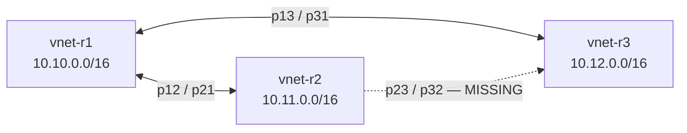

# Топология сети

> SSOT для всего, что касается «какие IP, какие подсети, что с чем связано». Если в коде/доках встречается противоречие — правда здесь.

## 1. Адресное пространство

| Уровень | CIDR | Где живёт |
|---|---|---|
| VNet r1 (australiaeast) | `10.10.0.0/16` | `azurerm_virtual_network.v1` |
| └─ Subnet s1 | `10.10.1.0/24` | `azurerm_subnet.s1` |
| VNet r2 (australiasoutheast) | `10.11.0.0/16` | `azurerm_virtual_network.v2` |
| └─ Subnet s2 | `10.11.1.0/24` | `azurerm_subnet.s2` |
| VNet r3 (southeastasia) | `10.12.0.0/16` | `azurerm_virtual_network.v3` |
| └─ Subnet s3 | `10.12.1.0/24` | `azurerm_subnet.s3` |
| WireGuard overlay | `10.100.0.0/24` | плоскость управления (Ansible role `05-overlay-network`) |

**Принцип нейминга:** `10.1X.0.0/16` где `X` = номер региона. Просто и читается с первого взгляда.

## 2. Узлы

| Узел | Регион | VNet/Subnet | Public IP | Private IP (пример) | Overlay IP |
|---|---|---|---|---|---|
| `az-app` | r1 | s1 | dynamic (см. `terraform output`) | dynamic | `10.100.0.10` |
| `az-db` | r1 | s1 | — | dynamic | `10.100.0.11` |
| `az-kafka` | r2 | s2 | — | dynamic | `10.100.0.12` |
| `az-etcd` | r2 | s2 | — | dynamic | `10.100.0.13` |
| `az-storage` | r3 | s3 | — | dynamic | `10.100.0.14` |

**Источник реальных IP:** `terraform output` или `terraform/.generated/ssh_config`.

**Overlay IP** генерируется детерминированно: `10.100.0.{index in groups['azure_nodes'] + 10}`. Изменение порядка узлов в inventory **переназначит overlay IP** — менять с осторожностью.

## 3. Peering между VNet

**Hub:** `r1` (полная связность с r2 и r3).
**Spoke без прямого пути:** `r2 ↔ r3` — пакеты не идут.

> **⚠️ Архитектурное решение по этой дыре открыто:** см. [ADR-0006](adr/0006-r2-r3-peering.md).

## 4. NSG (security groups)

| NSG | Применяется к | Inbound rules |
|---|---|---|
| `nsg1` | s1 (r1) | SSH (`var.operator_ip`), всё от `10.0.0.0/8` |
| `nsg-r2` | s2 | всё от `10.0.0.0/8` |
| `nsg-r3` | s3 | всё от `10.0.0.0/8` |

> **Замечание:** правило `10.0.0.0/8 → all ports` — широкое. Для capstone оправдано (Zero-Trust обеспечивается WireGuard поверх), но в прод нужно сегментировать по портам — см. [ADR-0004](adr/0004-wireguard-mesh-zero-trust.md).

## 5. Public-facing surface

Только `az-app` имеет public IP. Доступы:
- **22/tcp** — SSH с `var.operator_ip` (whitelist).
- **80/tcp**, **443/tcp** — HTTP(S) ingress (Nginx).
- **51820/udp** — WireGuard endpoint (для пиров из других VNet).

Все остальные узлы достижимы только:
- через ProxyJump `az-app` (для SSH);
- через VNet peering (для L3 внутри Azure);
- через WG overlay (для приложений).

## 6. WireGuard mesh

Реализация — Ansible role `05-overlay-network`. Принцип:
- Каждый узел получает свой keypair (`/etc/wireguard/{privatekey,publickey}`).
- `wg0.conf` рендерится из шаблона `wg0.conf.j2` — для каждого пира одна `[Peer]` секция.
- `Endpoint` = `ansible_host` пира (т.е. реальный приватный или публичный IP в VNet).
- `AllowedIPs` = overlay IP пира (`10.100.0.X/32`).
- `PersistentKeepalive = 25` — держит NAT-туннель для приватных пиров.

Все приложения (PG, Mongo, Kafka, etcd, ...) **слушают на overlay IP**, не на VNet IP. Это даёт Zero-Trust по-умолчанию: даже если кто-то получил VNet-доступ, он не достучится до сервиса без WG-ключа.

## 7. Изменения, которые перерисовывают эту страницу

При следующих действиях обнови этот файл и `last_verified`:
- Добавление/удаление узла.
- Изменение CIDR.
- Добавление/удаление peering.
- Смена принципа выдачи overlay IP.
